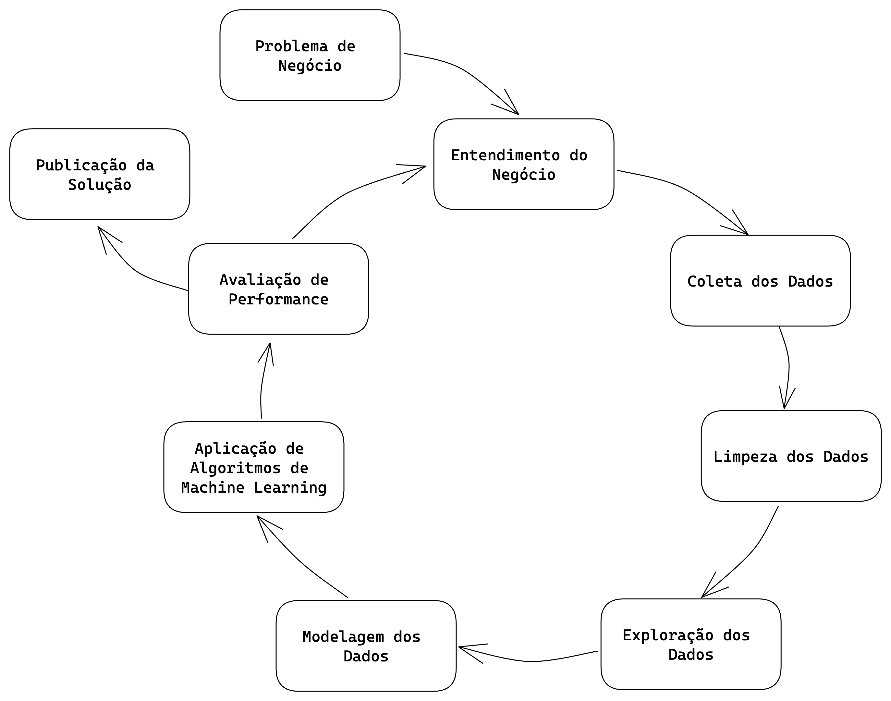
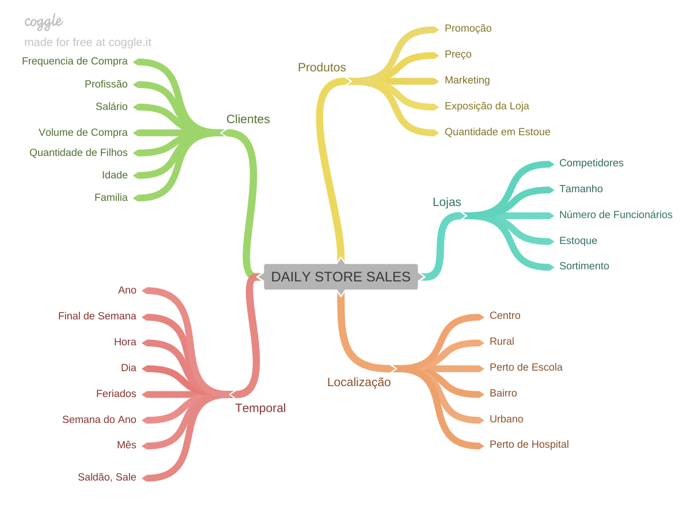
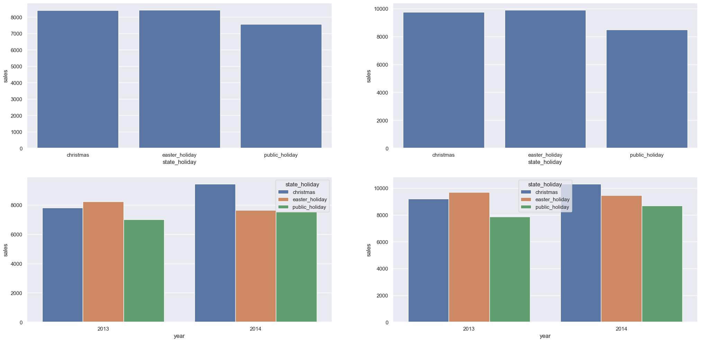
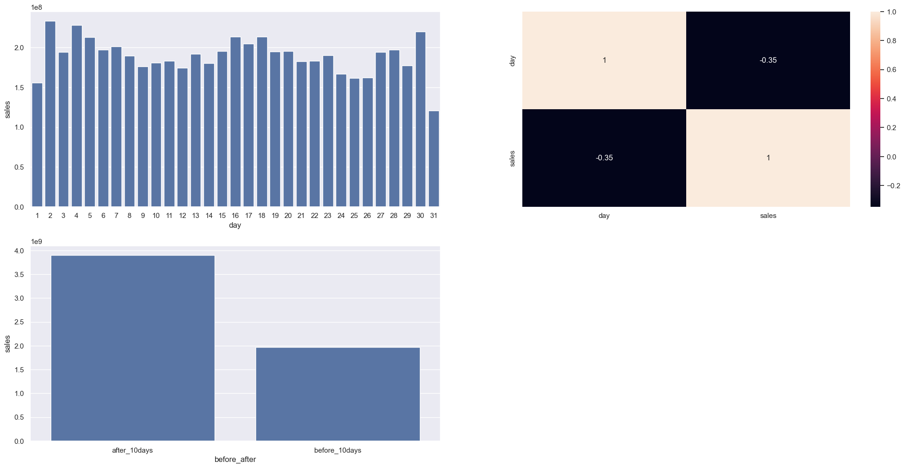
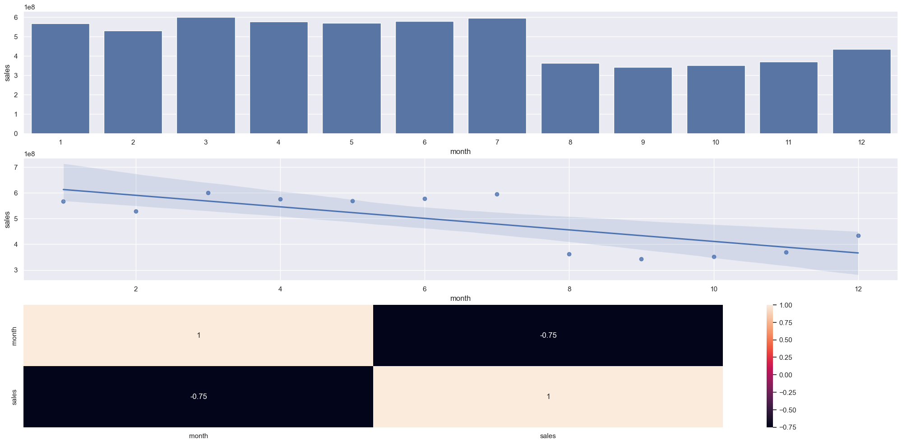

## Rossmann Sales Forecast

A Rossmann opera mais de 3.000 drogarias em 7 países europeus.
Atualmente, os gerentes de loja da Rossmann têm a tarefa de prever suas vendas diárias com até seis semanas de antecedência. As vendas da loja são influenciadas por muitos fatores, incluindo promoções, concorrência, feriados escolares e estaduais, sazonalidade e localidade. 

## Questão de negócio
Previsão de vendas das lojas para as próximas 6 semanas para alocação de recursos para reforma destas lojas.Com milhares de gerentes individuais prevendo vendas com base em suas circunstâncias únicas, a precisão dos resultados pode variar bastante.

## Fonte de dados:
https://www.kaggle.com/c/rossmann-store-sales/overview/description

## Ferramentas Utilizadas
- Python versão 3.8.15
- Versionador de código Git
- Aplicação Jupyter Notebook
- Serviço de Hospedagem Render
- Pandas, Seaborn, Matplotlib e Sklearn Flask e Python API's
- Boruta
- Machine Learning
- Algoritmos de Regressão (Regressão Linear/Lasso, Random Forest, XGBoost/LGBM Regressors)
- Cross-Validation, Hyperparameter Optimization
- Métricas de Performance (RMSE, MAE, MAPE)

## Entregue Final
Foi combinado com o CFO que será criado uma API que será utilizada para retornar as previsões das lojas. Essa API irá utilizar o modelo de Machine Learning desenvolvido para realizar a previsão. E então seria entregue um Bot dentro do aplicativo Telegram, facilitando assim que o CFO verifique a previsão das lojas independente do local em que ele esteja.

## Passos para a resolução do problema:

## Passos do CRISP-DS:
1. **Problema de Negócio:** Esta etapa tem como objtive receber o problema de negócio que será resolvido. É nesta etapa que é recebido a pergutna ou o pedido feito pelo dono do problema, que no caso deste projeto, é o CFO da rede Rossmann.
2. **Entendimento de Negócio:** Esta etapa tem como objetivo entender a dor do dono do problema e qual a sua real necessidade. Nesta etapa podem surgir protótipos da solução para validar com o dono do problema o que ele deseja como solução. 
3. **Coleta de Dados:** Esta etapa tem como objetivo realizar a coleta dos dados, buscando eles nas tabelas do(s) banco(s) de dados da empresa. 
4. **Limpeza dos Dados:** Esta etapa tem como objetivo remover toda e qualquer sujeira nos dados. Um dado sujo pode ser entendido como um dado que irá atrapalhar a performance final do algoritmo de Machine Learning. Tomando o cuidado entender bem o fenômeno que está sendo estudado para que não sejam removidos dados importantes para a modelagem do problema.
5. **Exploração dos Dados:** Esta etapa tem como objetivo entender os dados e como eles se relacionam entre si. Normalmente, são criadas hipóteses acionáveis de negócio que são posteriormente validadas utilizando técnicas de análise de dados. Além da criação de novas *features* que serão utilizadas na etapa de Modelagem de Dados.
6. **Modelagem dos Dados:** Esta etapa tem como objetivo preparar os dados para que eles sejam utilizados pelos algoritmos de Machine Learning. É nesta etapa que são feitos as transformações e *encodign* dos dados, a fim de facilitar o aprendizado do algoritmo utilizado.
7. **Aplicação de Algoritmos de Machine Learning:** Esta etapa tem como objetivo selecionar e aplicar algoritmos de Machine Learning nos dados preparados nas etapas anteriores. É nesta etapa que são selecionados os algoritmos e feito a comparação de performance enetre eles, para selecionar o algoritmos que melhor performou como algoritmo final.
8. **Avaliação de Performance:** Esta etapa tem como objetivo verificar a performance do algoritmo selecionado na etapa anterior com os resultados atuais, ou *base line* atual. Neste momento é feito a tradução da performance do algoritmo para perfomance de negócio. Ou seja, quanto a solução criada tratrá de retorno financeiro para a empresa. Caso a performance seja aceitável, o algoritmo é publicado e é retornado para a etapa de entendimento de negócio novamente, a fim entender melhor possíveis lacunas e assim melhorar a performance do algoritmo selecionado. Caso a performance não seja aceitável, o algoritmo não é publicado e é retornado para a etapa de entendimento de negócio para fazer uma nova iteração e assim melhorar a performance da solução.
9. **Publicação da Solução:** Esta etapa tem como objetivo publicar o algoritmo selecionado, deixando publico e utilizável a solução criada.

## Descrição dos dados 

|Atributo| Definição|
|--------|----------|
|Id| um id que representa uma loja e data no dataset|
|Store| um id único para cada loja|
|Sales| a receita em determinado dia (nossa variável resposta)|
|Customers| o número de clientes em determinado dia|
|Open| um indicador se a loja estava aberta: 0 = fechada, 1 = aberta|
|StateHoliday| indica um feriado estadual. Normalmente todas as lojas, com algumas exceções, estão fechadas em feriados estaduais. Todas as escolas estão fechadas em feriados públicos e fins de semana. a = public holiday, b = Easter holiday, c = Christmas, 0 = None.|
|SchoolHoliday| indica se a loja foi afetada por escolas públicas fechadas|
|StoreType| diferencia entre 4 modelos de loja: a, b, c, d|
|Assortment| descreve um nível de sortimento: a = basic, b = extra, c = extended|
|CompetitionDistance| distância em metros da loja competidora mais próxima|
|CompetitionOpenSince[Month/Year]| ano e mês aproximados da abertura do competidor mais próximo|
|Promo| indica se a loja está aplicando uma promoção no dia|
|Promo2| continuação consecutiva da promoção para algumas lojas: 0 = a loja não está participando, 1 = a loja está participando|
|Promo2Since[Year/Week]| descreve o ano e semana do calendário quando a loja começou a participar na Promo2|
|PromoInterval| descreve os intervalos consecutivos de início, nomeando os meses que a promoção recomeça. Ex.: 'Feb,May,Aug,Nov' significa que cada rodada começa em Fevereiro, Maio, Agosto, Novembro de qualquer ano para a loja|

# Top 3 Insights
Foi criado um Mindmap para ajudar na construção de Hipóteses, a fim de facilitar e delimitar o escopo da etapa de análise exploratória.

Através desse Mindmap, foram geradas 19 hipóteses de negócio, das quais 12 foram escolhidas para serem validadas, confirmando assim  premissas da equipe de negócios e do dono do problema, além da geração de insights para ambos.

Dessas 12 hipóteses verificadas, os 3 principais insights gerados foram:

## Insight 1: Lojas Abertas durante o feriado de Natal deveriam vender mais
**Hipótese Falsa:** Lojas que ficam abertas durante o feriado de natal não vendem mais em comparação a outros feriados

## Insight 2: Lojas Deveriam vender mais depois do dia 10 de cada mês
**Hipótese Verdadeira:** Lojas realmente vendem mais depois do dia 10 de cada mês

## Insight 3: Lojas deveriam vender mais no segundo semestre do ano
**Hipótese Falsa:** Lojas vendem MENOS no segundo semestre do ano

# Modelos de Machine Learning
Para o primeiro ciclo do projeto foram selecionados 5 algoritmos para teste, a fim de escolher o algoritmo que tivesse a melhor perfomance e o melhor custo de implementação. Foi optado pela simplicidade nessa etapa inicial, visto que era o primeiro ciclo do projeto e o objetivo principal era entregar uma solução que fosse mínimamente utilizável para a equipe de negócios e pelo CFO.

Os algotitmos selecionados foram:
- Avarege Model
- Linear Regression
- Linear Regression - Lasso
- Random Forest Regressor
- XGBRegressor

Após a escolha dos algoritmos, foram realizados treinamentos e testes com cada um deles, a fim de verificar qual deles teria a melhor perfomance.

Além disso, foi utilizado o método de seleção de *features* [Boruta](https://mbq.github.io/Boruta/) para auxiliar na escolha das *features* mais importantes e impactantes da base de dados.

# Seleção do Modelo de Machine Learning
## Esolha da Métrica
Foi utilizado a métrica ***MAPE (Mean Absolute Percentage Error)*** como parâmetro de escolha entre os algoritmos, porque esta métrica é mais fácil de ser consumida pela equipe de negócio e pelo CEO, visto que ela representa a porcentagem do erro em relação ao valor médio.

## Métricas dos Algoritmos
Após os testes inicias, obtivemos os seguintes resultados:

| Nome do Modelo            |         MAE |     MAPE |        RMSE |
| :------------------------ | ----------: | -------: | ----------: |
| Avarege Model             | 1354.800353 | 0.455051 | 1835.135542 |
| Linear Regression         | 1867.089774 | 0.292694 | 2671.049215 |
| Linear Regression - Lasso | 1891.704880 | 0.289106 | 2744.451735 |
| Random Forest Regressor   |  679.893818 | 0.099967 | 1011.038517 |
| XGBRegressor              |  865.126662 | 0.124905 | 1278.187883 |

## Métricas dos Algoritmos - *Cross Validation*
Após os testes com os algoritmos selecionados, foi utilizado a técnica de ***Cross Validation*** para validar os resultados e garantir a performance real de cada uma dos modelo utilizados. Como o problema se tratava de um série temporal, foi utilizada a técnica de ***Cross Validation*** específica para esse problema, respeitando assim a linha do tempo no treinamento dos algoritmos.

Com esse método de validação, foram obtidas as seguintes performances:

| Nome do Modelo                |             MAE CV |       MAPE CV |            RMSE CV |
| :---------------------------- | -----------------: | ------------: | -----------------: |
| Linear Regression             | 2081.73 +/- 295.63 |  0.3 +/- 0.02 | 2952.52 +/- 468.37 |
| Linear Regression Regularized |  2116.38 +/- 341.5 | 0.29 +/- 0.01 | 3057.75 +/- 504.26 |
| Random Forest Regressor       |  837.66 +/- 218.22 | 0.12 +/- 0.02 | 1255.81 +/- 318.76 |
| XGBoost Regressor             | 1045.83 +/- 182.93 | 0.14 +/- 0.02 |  1509.2 +/- 260.07 |

## Escolha do Modelo
Embora o algoritmo ***Random Fores Regressor*** tenha sido o algoritmo que melhor performou, foi optado pelo algoritmo ***XGBosst Regressor*** nesta etapa. 
- Primeiro, porque o erro entre esses dois algoritmos é pequeno.
- segundo porque o tempo de treinamento do ***XGBoost Regressor*** é mais rápido se comparado ao algoritmo ***Random Fores Regressor***. 
- Terceiro porque o modelo final treinado pelo algoritmo ***XGBoost Regressor*** ocupa menos espaço que o algoritmo ***Random Fores Regressor***, deixando assim o uso de servidores em nuvem mais baratos.

## Ajuste de Hiperparâmetros
Foi o utilizado a técnica de ***Random Search*** para fazer a busca dos melhores hyperparâmetros. Os testes realizados foram os seguintes:

| Tentativa |             MAE CV |       MAPE CV |            RMSE CV |
| :-------: | -----------------: | ------------: | -----------------: |
|  Teste 1  | 1298.59 +/- 145.92 | 0.18 +/- 0.01 | 1876.77 +/- 183.35 |
|  Teste 2  |  805.51 +/- 136.41 | 0.11 +/- 0.01 | 1178.01 +/- 207.34 |
|  Teste 3  |   1047.9 +/- 138.9 | 0.15 +/- 0.01 | 1509.67 +/- 188.21 |
|  Teste 4  |  806.21 +/- 129.75 | 0.11 +/- 0.01 | 1173.31 +/- 200.39 |
|  Teste 5  | 1028.34 +/- 126.16 | 0.14 +/- 0.01 | 1472.95 +/- 162.73 |
|  Teste 6  | 1521.97 +/- 165.69 | 0.21 +/- 0.01 | 2204.28 +/- 210.19 |
|  Teste 7  |  1307.5 +/- 132.12 | 0.18 +/- 0.01 | 1896.64 +/- 182.21 |
|  Teste 8  |  889.96 +/- 123.96 | 0.12 +/- 0.01 | 1278.13 +/- 179.34 |
|  Teste 9  |  797.98 +/- 155.47 | 0.11 +/- 0.01 |  1157.82 +/- 228.1 |
| Teste 10  |  1081.47 +/- 115.4 | 0.15 +/- 0.01 | 1546.74 +/- 159.11 |

Sendo que os parâmetros do **Teste 4** foram os selecionados como os melhores parâmetros para o treinamento do modelo.

##  Performance do Modelo
Como podemos observar nos dois primeiro gráficos abaixo, o modelo selecionado obteve uma performance aceitável, visto que conseguiu entender e reproduzir o padrão de vendas ao longo dos anos estudados.

Já nos dois últimos gráficos, podemos observar uma distribuição normal a cerca das previsões, o que nos inidica um bom resultado do modelo selecionado, além de podermos verificar a distribuição dos erros do modelo.

#  Resultado de Negócio
Com o modelo selecionado e treinado, obtivemos a seguinte performance de negócio para as 5 melhores lojas:

| ID da Loja |     Previsões |  Pior Cenário | Melhor Cenário |       MAE |   MAPE |
| :--------- | ------------: | ------------: | -------------: | --------: | -----: |
| 259        | \$ 542,261.00 | \$ 541,643.54 |  \$ 542,878.46 | \$ 617.46 | 0.0483 |
| 990        | \$ 235,996.80 | \$ 235,689.77 |  \$ 236,303.82 | \$ 307.03 | 0.0485 |
| 1089       | \$ 378,721.16 | \$ 378,205.41 |  \$ 379,236.90 | \$ 515.75 | 0.0488 |
| 1097       | \$ 440,957.44 | \$ 440,370.68 |  \$ 441,544.20 | \$ 586.76 | 0.0541 |
| 667        | \$ 314,811.66 | \$ 314,324.37 |  \$ 315,298.95 | \$ 487.29 | 0.0551 |

Um ponto importante de ressaltar, é que houveram algumas lojas que não obtiveram bons resultados, e que em uma próxima iteração deve ser tratadas individualmente para verificar qual pode ser o problema para essas lojas. As 5 piores lojas tiveram a seguinte performance:

| ID da Loja |     Previsões |  Pior Cenário | Melhor Cenário |         MAE |  MAPE |
| :--------- | ------------: | ------------: | -------------: | ----------: | ----: |
| 292        | \$ 103,891.24 | \$ 100,561.08 |  \$ 107,221.41 | \$ 3,330.17 | 0.562 |
| 909        | \$ 237,516.14 | \$ 229,953.85 |  \$ 245,078.43 | \$ 7,562.29 | 0.511 |
| 876        | \$ 206,953.81 | \$ 202,905.53 |  \$ 211,002.09 | \$ 4,048.28 | 0.316 |
| 722        | \$ 353,882.56 | \$ 351,866.71 |  \$ 355,898.42 | \$ 2,015.85 | 0.268 |
| 274        | \$ 195,549.67 | \$ 194,157.14 |  \$ 196,942.21 | \$ 1,392.54 | 0.244 |

Como resultado final, temos os seguintes cenários:

| Cenários       |           Valores |
| :------------- | ----------------: |
| Previsão Feita | \$ 285,901,376.00 |
| Pior Cenário   | \$ 285,158,456.49 |
| Melhor Cenário | \$ 286,644,307.44 |

## Deploy do Modelo
Para facilitar o acesso, o modelo foi implantado no serviço em nuvem Render, com os resultados completos para cada loja, que pode ser consultado através do Telegram Bot.

Para fazer a consulta, basta enviar uma mensagem no formato "/store_number" (ex: /23). O Bot responderá com o valor previsto para as próximas seis semanas, ou caso o número da loja não exista ou qualquer outro tipo de mensagem, apresentará a mensagem "Store Not Available".

 

#  Conclusões
Conforme pôde ser verificado, o projeto resolveu o problema inicial, que era a previsão de faturamento das lojas feitas de forma manual por seus gerentes.

Outro ponto importante de destacar é que com a solução criada, o CFO pode agora consultar as lojas de forma automática utilizando o BOT criado, dando mais agilidade na tomada de decisão.

#  Lições Aprendidas
* Priorizar tarefas e soluções
* Desenvolver soluções de forma cíclica, entregando assim resultado mais rapidamente
* Construção de um BOT para o aplicativo de mensagens Telegram, afim de agilizar o acesso à informações.

#  Próximos Passos
* Investigar a razão de algumas lojas estarem com previsões ruins
* Selecionar outros algoritmos para treinamento no próximo ciclo, a fim de buscar uma solução que melhore o desempenho da previsão
* Criar uma apllicação Web utilizando o framework Streamlit para dar acesso Web às previsões para os gerentes das lojas.
* Implementar testes unitários nas classes e funções produzidas.
* Criar novas *Features* para tentar melhorar a perfomance do modelo atual e de modelos futuros.
* Aplicar técnicas de programação para melhorar o desempenho da solução criada.
